# Gem5 Assignment


In this assignment we are going to be System call Emulation (SE) where we focus on running a specific program in contrast with Full System (FS) mode where we emulate an entire operating system.

## Project Overview

```
📁 gem5
├── 📂 bash_scripts - Scripts used to automate running the various benchmarks
│   
├── 📂 hello_world
│   ├── 📂 stats
│   │   ├── 📄 config.ini
│   │   ├── 📄 config.ini
│   │   └── 📄 stats.txt
│   └── 🐍 starter_se.py - python gem5 running script
│
├── 📂 spec_cpu2006
│   ├── 📂 Results_1 - spec_cpu2006 benchmark results
│   ├── 📂 Results_2 - spec_cpu2006 benchmark results cpu-clock=1GHz
│   ├── 📂 Results_3 - spec_cpu2006 benchmark results cpu-clock=4GHz
│   ├── 📂 Results_4 - spec_cpu2006 benchmark results cpu-clock=4GHz DDR3_2133_x64
│   └── 📂 Results_5 - spec_cpu2006 benchmark results cache experimentation
│   
├── 📂 tri
│   ├── 📂 MinorCPU - Results with CPU model 1
│   │   ├── 📄 config.ini
│   │   ├── 📄 config.ini
│   │   └── 📄 stats.txt
│   ├── 📂 TimingSimpleCPU - Results with CPU model 2
│   │   ├── 📄 config.ini
│   │   ├── 📄 config.ini
│   │   └── 📄 stats.txt
│   ├── ▶️ tri.c - Triangular number finding program
│   └── ⚙️ Makefile
│
├── 📂 media
│   ├── 🖼️ png 1
│   ├── 🖼️ png 2
│   └── 🖼️ etc ...
│
├── ⚙️ Makefile - Compiles the report
├── 📝 gem5.md - The markdown version of the report
└── 📄 gem5.pdf - The pdf version to the report
```

## Step 1: Downloading Gem5

In this assingment we utilize a ready built virtual machine which has the correct ubuntu version, the necessary dependencies and the gem5 tool preinstalled.

## Step 2: Hello World

Starting off we run a simple "Hello world!" program using the starter_se.py script. This configures the gem5 simulator by defining the following parameters:

- CPU 
    - Type: Minor
    - Cores: 1  
    - Clock: 1GHz
    - Voltage: 3.3V
- Caches
    - Cache line size: 64 columns
    - L1 Instruction cache
    - L1 Data cache
    - L2 cache
    - Walk cache
- Memory
    - DDR3 1600 8x8
    - 2 memory channels
    - 2 GB
- Others
    - Off-chip memory bus

```bash
# Navigate inside your gem5 folder
cd ~/Desktop/gem5

# Command
./build/ARM/gem5.opt configs/example/arm/starter_se.py --cpu="minor" "tests/test-progs/hello/bin/arm/linux/hello"
```

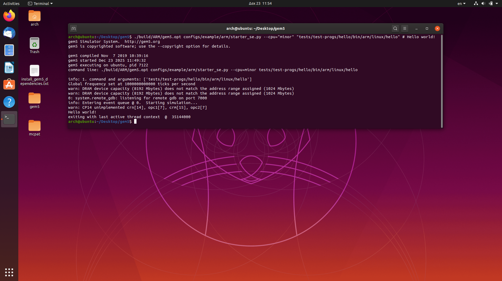

Through the following files:

- stats.txt
- config.ini
- config.json

we attain detailed information regarding our system. Through these we cross-check the system info we derived from the python script.

```
stats.txt - relevant lines
--------------------------

sim_seconds                                  0.000035                       # Number of seconds simulated
sim_ticks                                    35144000                       # Number of ticks simulated
sim_insts                                        5027                       # Number of instructions simulated
host_inst_rate                                 155696                       # Simulator instruction rate (inst/s)
system.cpu_cluster.cpus.committedInsts           5027                       # Number of instructions committed
system.cpu_cluster.cpus.dcache.demand_accesses::total         2160                       # number of demand (read+write) accesses
system.cpu_cluster.l2.demand_accesses::total          474                       # number of demand (read+write) accesses

```

Resulting table:

| Parameter                  | Value    |
| -------------------------- | -------- |
| sim_seconds                | 0.000035 |
| sim_ticks                  | 35144000 |
| sim_insts                  | 5027     |
| host_inst_rate             | 155696   |
| committedInsts             | 5027     |
| dcache.demand_accesses     | 2160     |
| l2.demand_accesses         | 474      |

An alternative way to calculate the number of data L1 and L2 cache accesses would be to:
- L1 data: Through the miss rate and the total misses.

```
system.cpu_cluster.cpus.dcache.overall_misses::total          177                       # number of overall misses
system.cpu_cluster.cpus.dcache.overall_miss_rate::total     0.081944                       # miss rate for overall accesses

```

$$\frac{177}{0.081944}=2160.0117$$

- L2: Through the L1 data and instruction cache misses. When the program can't find the information on the L1 cache the next step is to search L2. From this sum we also have to subtract the MSHRs hits(Miss Status Holding Registers) which represent the times a line was being fetched to L1 from a previous request.  

```
system.cpu_cluster.cpus.icache.demand_misses::total          327                       # number of demand (read+write) misses
system.cpu_cluster.cpus.dcache.demand_misses::total          177                       # number of demand (read+write) misses
system.cpu_cluster.cpus.dcache.demand_mshr_hits::total           30                       # number of demand (read+write) MSHR hits
```

$$ 327+177-30=474 $$


### The different CPU models

In the documentation we can explore and learn more about the [different cpu models](https://www.gem5.org/documentation/general_docs/cpu_models/) gem5 provides:

- SimpleCPU
    - A purely functional, in-order CPU model that is suited for cases where a detailed model is not necessary. Its subcategories include: BaseSimpleCPU, AtomicSimpleCPU and TimingSimpleCPU.
        - BaseSimpleCPU: The base the next two CPU models use.
        - AtomicSimpleCPU: Uses atomic memory accesses. It uses the latency estimates from the atomic accesses to estimate overall cache access time.
        - TimingSimpleCPU: Uses timing memory accesses. It stalls on cache accesses and waits for the memory system to respond prior to proceeding.
        
- O3CPU
    - An out of order CPU model loosely based on the Alpha 21264. It follows 5 pipeline stages. 
        - fetches the instractions, 
        - decodes them, 
        - renames them using a physical register file,
        - handles dispatching instructions to the instruction queue, telling the instruction queue to issue instruction, and executing and writing back instructions
        - commits instructions.
    It is very timing accurate.
- TraceCPU
    - Utilizes dependency and timing annotated traces called "elastic traces" developed for single threaded benchmarks. They are generated by the Elastic Trace Probe which is attached to the O3 CPU model. Its mission is to achieve memory-system (cache-hierarchy, interconnects and main memory) performance exploration in a fast and reasonably accurate way. Comparatively to the O3 CPU Model, TraceCPU manages significantly faster times. 
- MinorCPU
    - An in-order processor model with a fixed pipeline but configurable data structures and execute behaviour. Its predominant use case is to model processors with strict in-order execution behaviour. Moreover it allows visualisation of an instruction’s position in the pipeline through the MinorTrace/minorview.py format/tool. The intention is to provide a framework for micro-architecturally correlating the model with a particular, chosen processor with similar capabilities.

## Step 3: First Program

The next step has us create a simple C-lang trinagular number generator program and cross compiling it to run on the gem5 simulator. A triangular number can be defined as:

$$ T_N = \frac{(N+1)*N}{2} $$

### Cross-compilation 

We currently are edveloping a program on an x86 based processor. To compile this program to be able to run on an arm machine we make use of the gcc arm cross-compiler.

```bash
# Installing cross compilers
sudo apt install gcc-arm-linux-gnueabihf
sudo apt install g++-arm-linux-gnueabihf
```

The [Makefile](/gem5/tri/Makefile) we created for this program includes a **make arm** option. It uses the compiler we installed previously and the **--static** flag since we must incorporate all of the program's dependencies inside the executable.

```bash
# Running the simulation, CPU Model 1
./build/ARM/gem5.opt configs/example/se.py 
    --cpu-type=MinorCPU 
    --caches -c "/home/arch/Downloads/tri" --options "7"
# Running the simulation, CPU Model 2
./build/ARM/gem5.opt configs/example/se.py 
    --cpu-type=TimingSimpleCPU 
    --caches -c "/home/arch/Downloads/tri" --options "7"
```

| | MinorCPU | TimingSimpleCPU |
|-|----------|-----------------|
|sim_seconds|0.000038|0.000042|
|sim_ticks|37556000|42098000|
|sim_insts|8920|8863|
|host_inst_rate|129333|628622|
|committedInsts|8920|8863|
|dcache.demand_accesses|3255|2962|
|l2.demand_accesses|-|-|

First of all, the using the se.py python script doesn't create L2 cache. Other than that we notice three things; MinorCPU is slightly faster, accesses L1 data cache more times and and its simulation's instruction rate is a lot lower. 

TimingSimpleCPU takes longer to complete because it stalls on cache accesses and waits for the memory system to respond before proceeding. It is also a more computationally intensive model to simulate which explains the higher host instruction rate. 

The two models function differently in terms of accesses MinorCPU uses

## Step 4: SPEC CPU2006 Benchmark

SPEC CPU2006 is a benchmarking suite that stresses a system's:

- CPU
- Memory
- Compiler

It is trying to emulate computationally intensive real usage scenarios.

To run the following 5 benchmarks of the spec_cpu2006 suite:

- specbzip
- spechmmer
- speclibm
- specmfc
- specsjeng

we execute the [run_benchmarks.sh](/gem5/bash_scripts/run_benchmarks.sh) script.

```bash
bash run_benchmarks.sh 
```

To gather the important information derived from these benchmarks we use the script [read_results.sh](/gem5/bash_scripts/read_results.sh) which accelerates the gathering process while [stats_finder.ini](/gem5/bash_scripts/stats_finder.ini) specifies the:
- benchmarks we include in our report,
- parameters we are searching for in the stats.txt and
- output file name.

The script and .ini file location has to be inside the folder containing all the benchmark results. The script then searching for the **stats.txt** files in each results folder, traverses them, attains the relevant inforamtion and writes them in a text file. This can later be imported to excel to generate graphs.

```bash
~/Desktop/gem5/spec_results
```

### Benchmark Results

Some basic memory information that can be found on config.ini (or config.json) include:

|Attributes     |  specbzip   |  spechmmer  |  speclibm   |   specmfc   |  specsjeng  |
|---------------|-------------|-------------|-------------|-------------|-------------|
|cache_line_size| 64          | 64          | 64          | 64          | 64          |
|l1.dcache.size | 65536       | 65536       | 65536       | 65536       | 65536       |
|l1.dcache.assoc| 2           | 2           | 2           | 2           | 2           |
|l1.icache.size | 32768       | 32768       | 32768       | 32768       | 32768       |
|l1.icache.assoc| 2           | 2           | 2           | 2           | 2           |
|l2.cache.size  | 2097152     | 2097152     | 2097152     | 2097152     | 2097152     |
|l2.cache.size  | 8           | 8           | 8           | 8           | 8           |
|dram.type      |DDR3_1600_x64|DDR3_1600_x64|DDR3_1600_x64|DDR3_1600_x64|DDR3_1600_x64| 

To figure out the dram type, which is not explicitly states we can use the following values to produce it.

$$device\_bus\_width \times devices\_per\_rank = bus\_bits\Rightarrow$$

$$\Rightarrow 8 \times 8 = 64-bit bus $$
tCK = 1250ps

$$ freq = \frac{1}{tCK} = \frac{1}{10^{-12}\times1250} = 800 MHz $$
But since DDR transfers data on both edges this is doubled.

$$ burst\_length = 8 \Rightarrow \text{typical of DDR3} $$

Alternatively, tracing our steps from [se.py](spec_cpu2006/se.py) to [MemConfig.py](spec_cpu2006/MemConfig.py) and finally to [Options.py](spec_cpu2006/Options.py) we can clearly see that the default value, when not specifying the memory type with the relevant flag, is DDR3_1600_8x8.

Here can be seen the:

- CPI (Cycles Per Instruction)
- Simulated seconds
- dcache miss rate
- icache miss rate 
- l2 cache miss rate
- Total Instructions

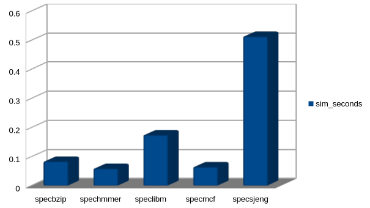
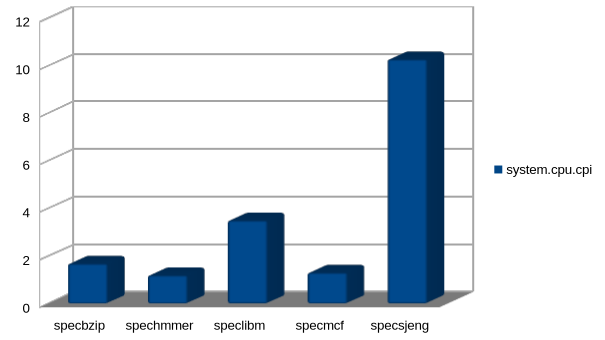

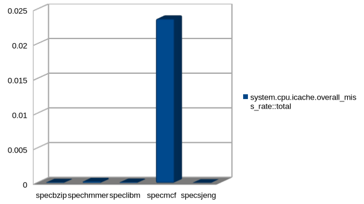
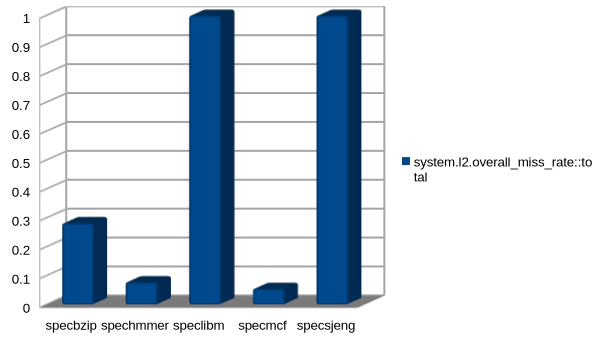
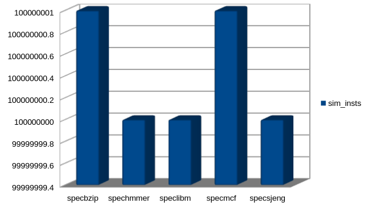

Afterwards we execute the same automation script adding the flags "--cpu-clock=1GHz", "--cpu-clock=4GHz". It is important to note that up to this point the default cpu-clock value has been 500 ticks $\Rightarrow$ 2GHz.

### CPU Clock 1GHz

| Constant parameters |   Value   |
| ------------------- | --------- |
| Instructions        | 100000000 |
| System Clock        | 1000      |
| CPU Clock           | 1000      |


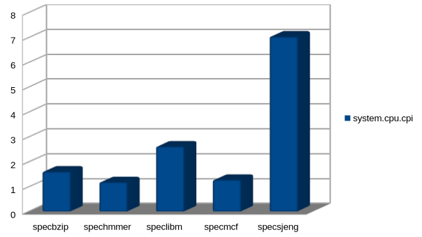


### CPU Clock 4GHz

| Constant parameters |   Value   |
| ------------------- | --------- |
| Instructions        | 100000000 |
| System Clock        | 1000      |
| CPU Clock           | 250       |

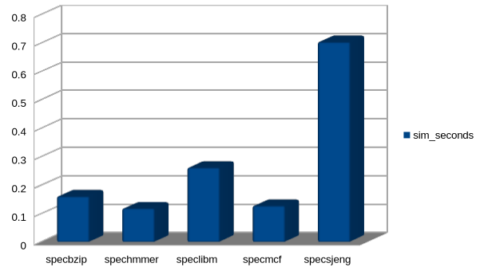
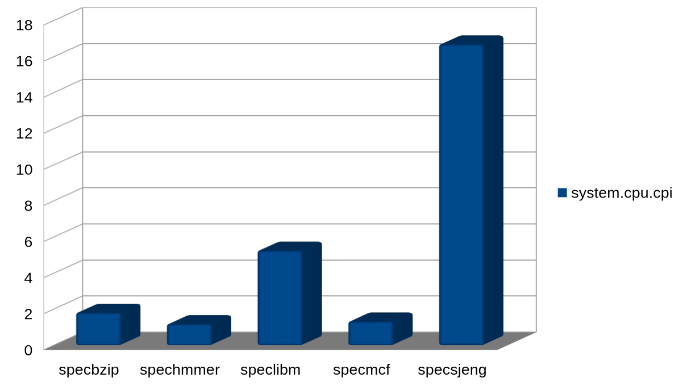
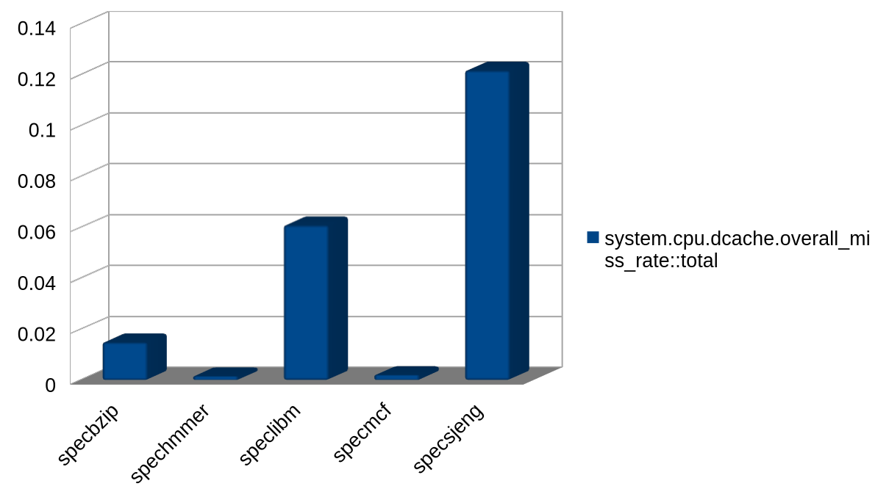
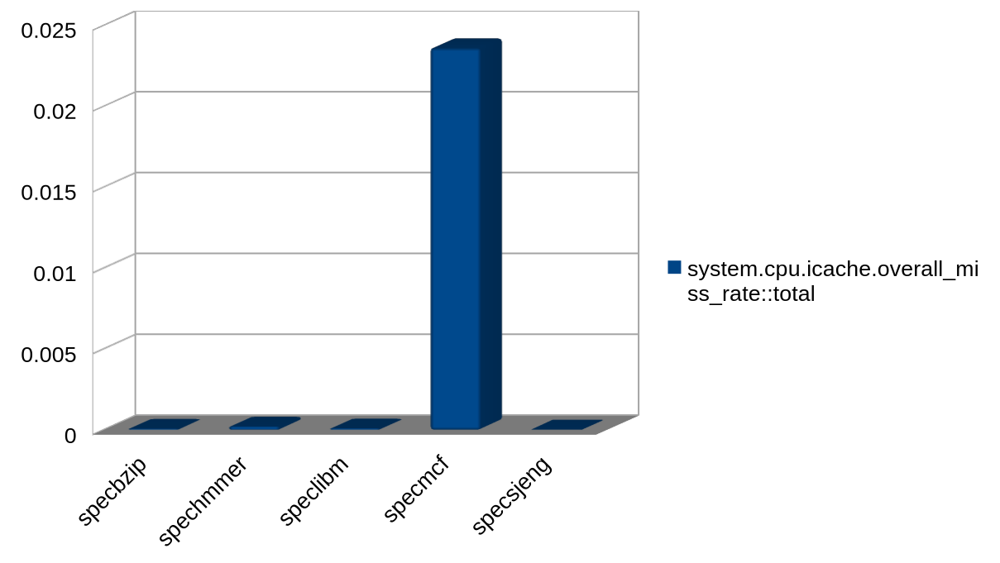
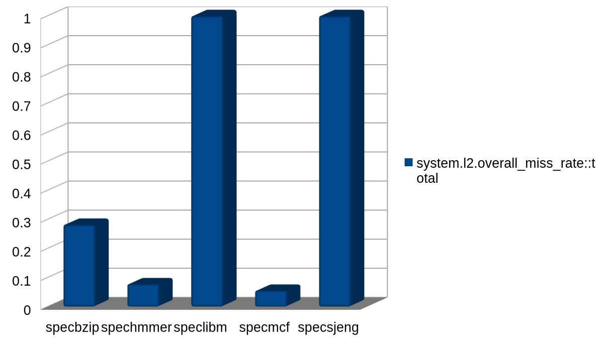

#### Why are there different frequencies?

When changing the CPU clock speed this only affects the cpu's clock. The global/system clock remains the same. The reason for this split is due to the fact that we don't need such a high frequency clock for all procedures. For example the memory bus which inherits the system's frequency is usually run at lower frequencies 1600MHz. This conserves energy by having part of the circuit run on a lower frequency and subsequently reduces the thermal impact which could cause throttling. 

#### What would the cpu frequency be if we added a second cpu?

All cores would run at the same frequency.

#### Is there perfect scaling in different clock systems? If not why?

No, we don't observe perfect scaling through our benchmarks. Cache misses values remain almost constant when comparing the 1GHz with the 4GHz CPUs, throughout all benchmarks. This means that the program will spend more cycles on a miss negatively affecting CPI. Additionally the system clock operates at the same clock which doesn't allow for perfect scaling along with the previous factors.

Through the stats.txt findings we can confirm cpu clock speed that we set:

- system.cpu_clk_domain.clock = 1000
- system.cpu_clk_domain.clock = 250

$$ T = 250 \times 10^{-12} \quad \text{and} \quad T = 1000 \times 10^{-12} $$
$$ f = \frac{1}{T} = 4GHz \quad \text{and} \quad f = \frac{1}{T} = 1GHz $$


### Memory type DDR3_2133_x64 (and CPU Clock 4GHz)

| Constant parameters |   Value   |
| ------------------- | --------- |
| Instructions        | 100000000 |
| System Clock        | 1000      |
| CPU Clock           | 250       |

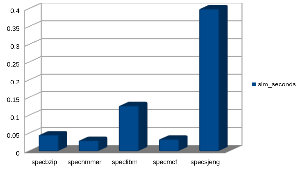
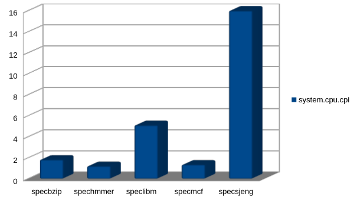
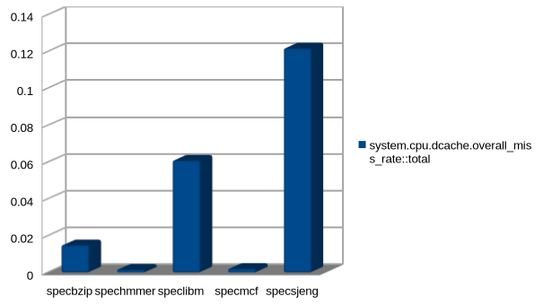


Observations:  
The simulation seconds have been slightly lowered though it is not statistically significant. This pattern applies to the rest of the system parameters as well 

## Step 4: Performance Optimization

At this point we will be tweaking the following values:

- Cache line size
- L1 Instruction cache size
- L1 Instruction cache associativity
- L1 Data cache size
- L1 Data associativity
- L2 cache size
- L2 associativity

We start off by setting some restrictions sourcing from a theoretical standpoint:

- L1 cache <= 256KBytes
- L2 cache >= 256KBytes
- L1 association: 2, 4
- L2 association: 4, 8
- Cacheline size: 32, 64, 128

In cache memory setup optimization we have to balance the tradeoff between latency and size. Increasing the size the miss rate decreases but the latency also increases. Likewise decreasing the size means that the CPU will have to search for that block on the next level of memory (E.g. L1 $\Rightarrow$ L2). L1 cache is the memory closest to the CPU. To fully benefit from the first level cache's speed we keep its size below 256kB. The L2 cache has to be larger than the L1 cache and smaller than 4MB, as disclosed by the assignment. To keep the number of total benchmarks low we further decrease the largest possible L2 cache size value seeking to explore the CPU's behavior at around 256kB which is the largest L1 can get in our example. However we acknowledge the advantage of fitting more data into the second stage of cache in detriment of its speed. 

L1 cache tends to benefit more from lower set associativity because it is closer direct mapping, the fastest mapping method, while also avoiding thrashing. L2 on the other hand benefits from higher set associativity since it reduces the cache misses. However, this makes it slower too. 

Lastly, common cache line sizes include [32, 64 and 128](https://www.nic.uoregon.edu/~khuck/ts/acumem-report/manual_html/ch03s02.html) bytes.

To conduct our experiments we fully automate the procedure using a [script](bash_scripts/cache_optimization.sh) that launches 1537 instances of the speclibm benchmark, covering the above theoretically viable parameter values.

The results show a tie between multiple configurations timing at 0.019812 seconds of simulation time as shown below:

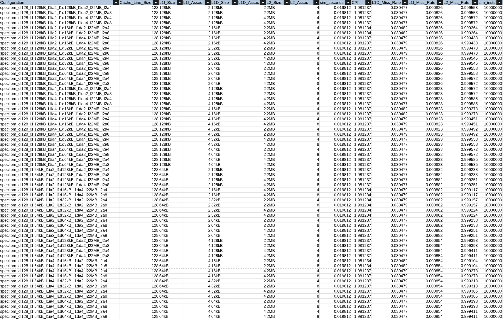

The clear takeaways are:
- Cacheline size = 128B
- L2 cache size = 2MB
- L1 instruction cache size = 128kB or 64kB

The other parameters were not that impactful on this particular benchmark. This is to say they could be use interchangeably to yield the same results.

In order to highlight the change each individual parameters bring about, we will select one of the viable winning configurations (the one aligned closest with the documentation), keep all other parameters constant and plot the results. 

### Reference winning configuration
- Cache line size = 128 bytes
- L1 Instruction cache size = 64kBytes
- L1 Instruction cache associativity = 2
- L1 Data cache size = 64kBytes
- L1 Data associativity = 2
- L2 cache size = 2MBytes
- L2 associativity = 8

Note that apart from the simulated seconds plot, any other plots were included when observing significant variation in results. Even simulated seconds often times was identical and consequently any omission can be attributed there. Additionally since CPI and simulated seconds go hand in hand the chosen main metric of choice was sim_seconds even though CPI can be used to compare different benchmarks / applications. If we were to use CPI to rank the results the difference would be minimal as for example the winning configurations were divided between $CPI = 1.981234$ and $CPI = 1.981237$ which goes to show that its a more precise metric. All in all every comment still applies.

### Cache line size

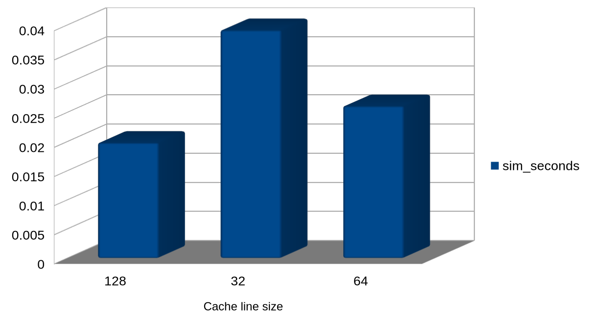

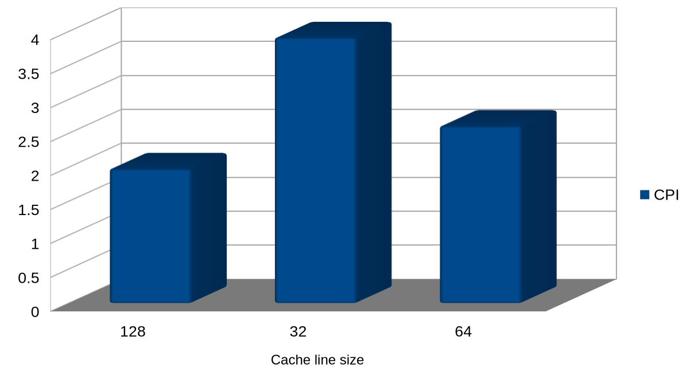

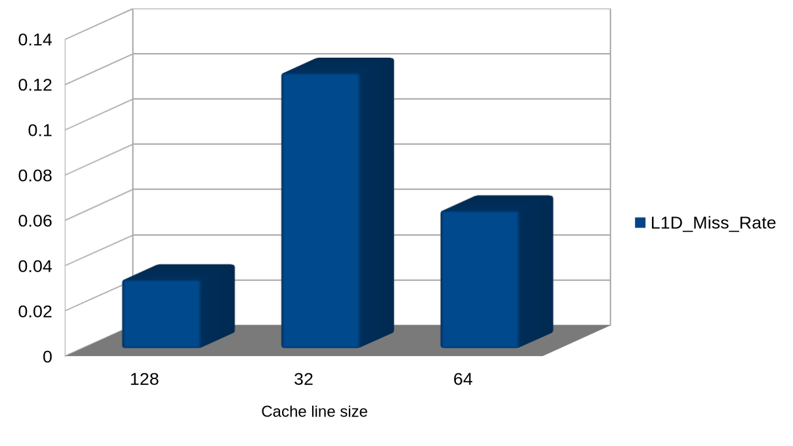

### L1 instruction cache size

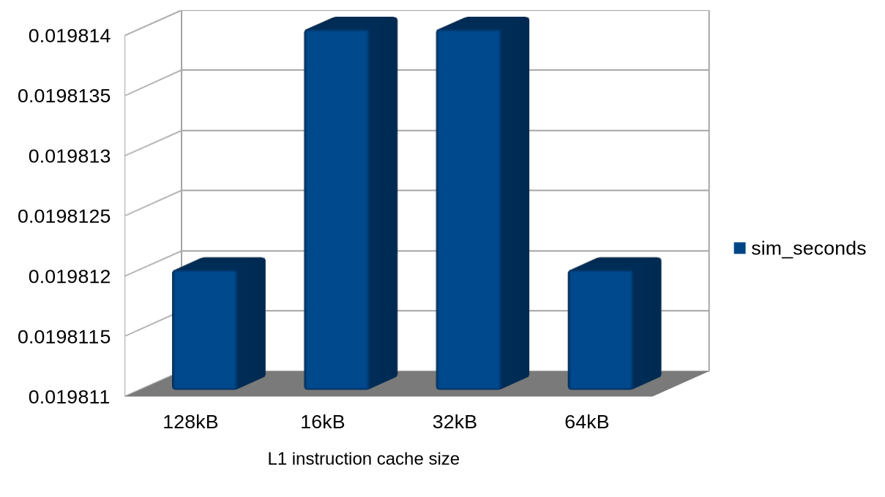

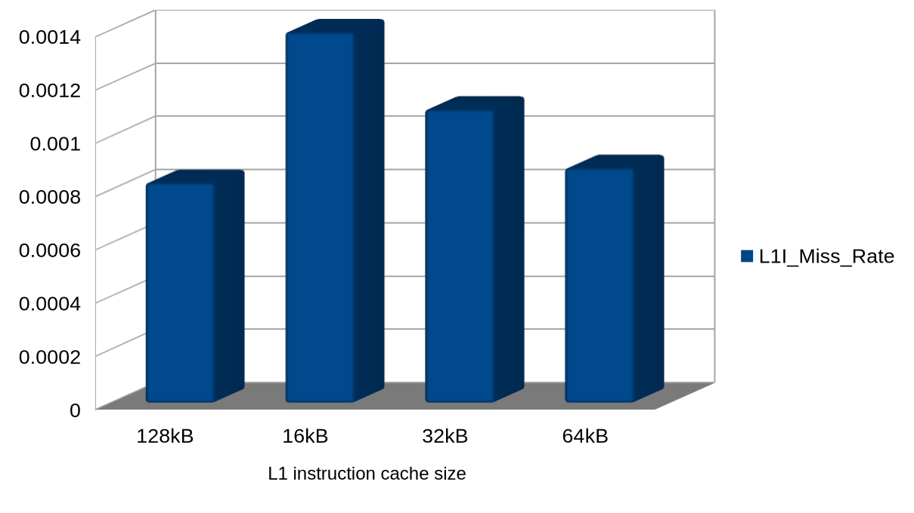

### L1 data cache size

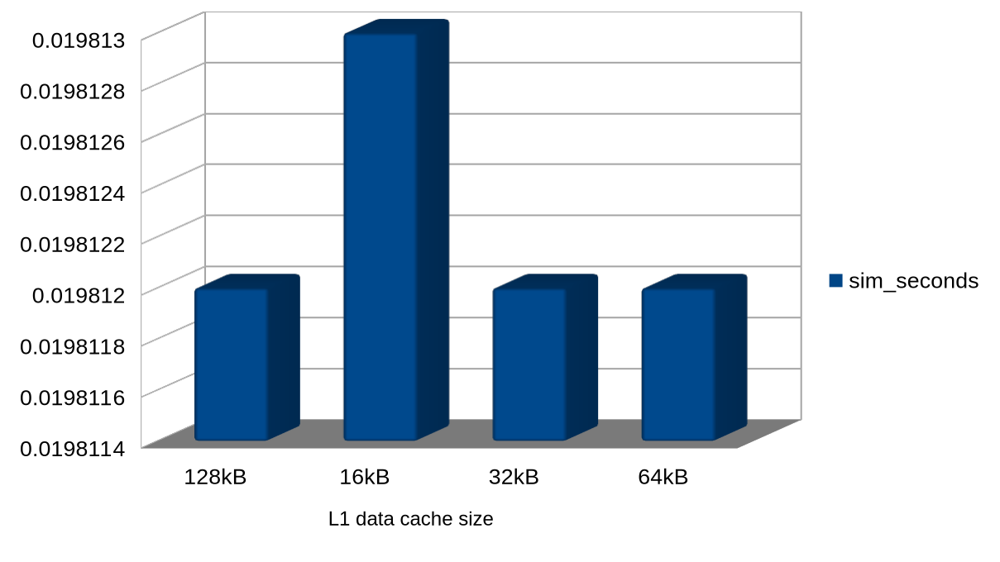

### L2 cache size

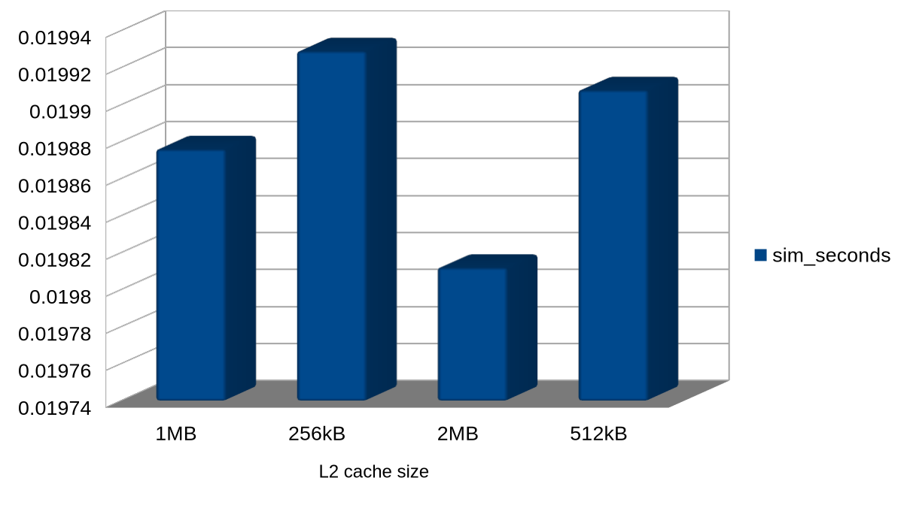

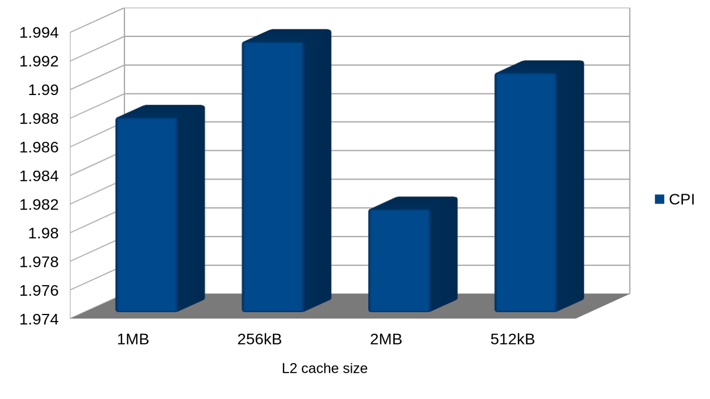

### Overall

To more clearly see the emerging patterns we present the overall simulated seconds with regard to each parameter.

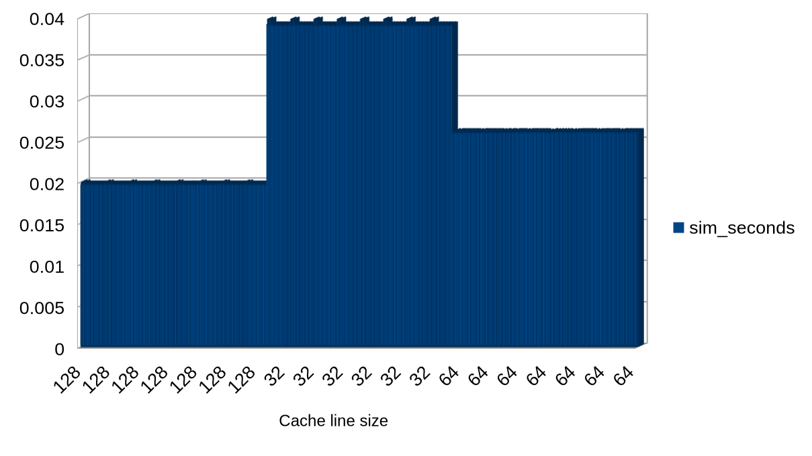


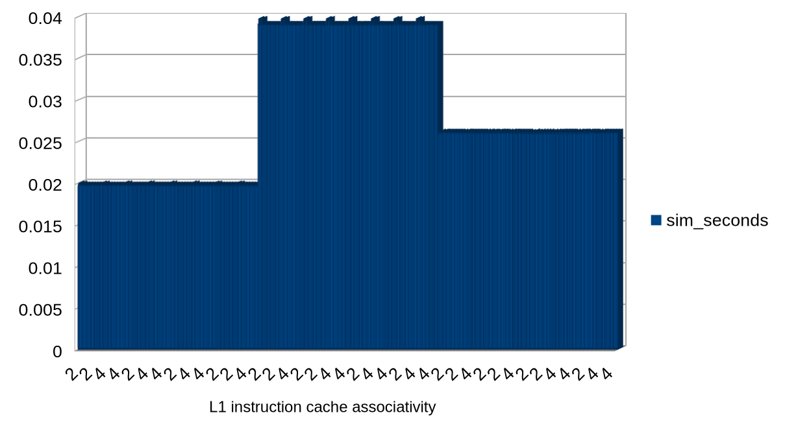

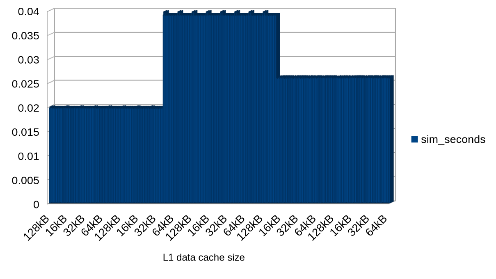


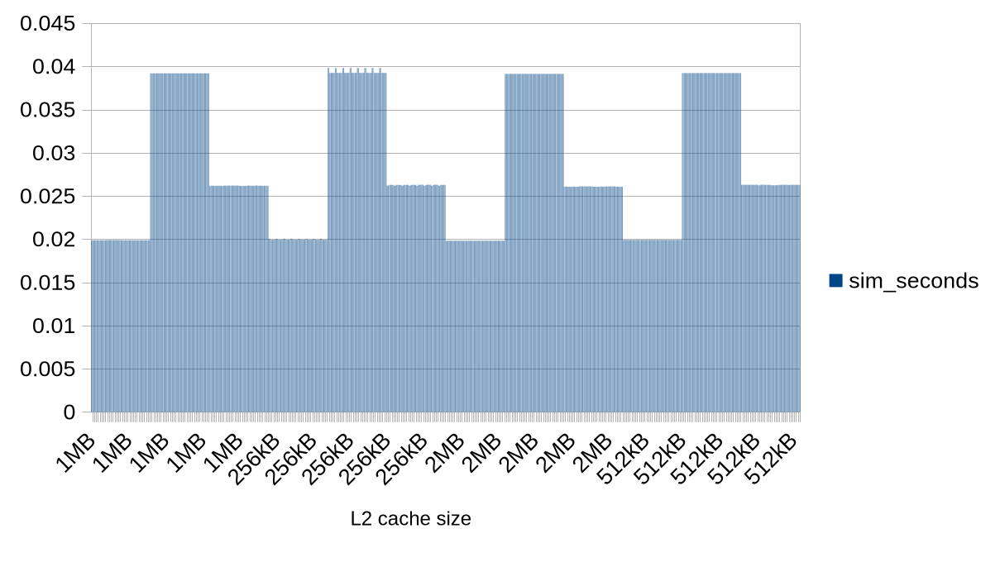

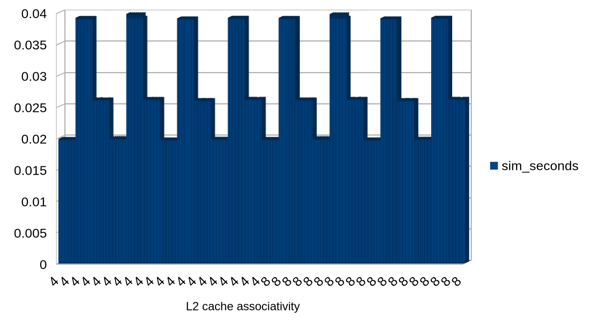

## Step 5: Cost Function as a means for Performance Optimization

The equation that can best illustrate the cost - benefit relationship using the aforementioned variables is disclosed here:

- Cache line size = $x_1$, where $D_{f(x_1)}$= {32, 64, 128}
- L1 Instruction cache size = $x_2$, where $D_{f(x_2)}$= {16, 32, 64, 128}
- L1 Instruction cache associativity = $x_3$, where $D_{f(x_3)}$= {2, 4}
- L1 Data cache size = $x_4$, where $D_{f(x_4)}$= {16, 32, 64, 128}
- L1 Data associativity = $x_5$, where $D_{f(x_5)}$= {2, 4}
- L2 cache size = $x_6$, where $D_{f(x_6)}$= {256, 512, 1024, 2048}
- L2 associativity = $x_7$, where $D_{f(x_7)}$= {4, 8}

Normalization:

$$x_{inorm}=n_i=\frac{x_i + x_{imin}}{x_{imax} - x_{imin}}$$

- Normalization is used to equalize the amount each parameter contributes to the final result and to be able to apply freely any multipliers afterwards 
- Fractions are used for inversely proportional relationships
- The 10 multipliers on $n_1$ and $n_6$ show the greater importance of cache line size and L2 size on the final result
- The 0.1 multiplier is used to reduce the effect of the monetary cost so that we can focus mainly on performance
- The 0.5 multiplier is used on each parameter that is thought to be of lesser importance to performance of monetary cost respectively
- The 2 multiplier on L1 cache highlights the relatively higher price of making compared to L2 cache
- The +1 on the denominator helps avoid division by zero and caps the result at 1 for $n_i = 0$

$$ Cost_{Performance} =\frac{1}{10n_1 + 1} + n_2 +  0.5 \times n_3 + n_4 +  0.5 \times n_5 + \frac{1}{10n_6 + 1} +  0.5 \times \frac{1}{n_7 + 1}$$

$$ Cost_{Money} =  0.1 \times (2 \times \frac{1}{n_2 + 1} + 0.5 \times n_3 + 2 \times \frac{1}{n_4 + 1} + 0.5 \times n_5 + n_6 + 0.5 \times n_7 )$$

Therefore:

$$ Cost = Cost_{Performance} + Cost_{Money} \Rightarrow$$
$$ \Rightarrow Cost = \frac{1}{10n_1 + 1} + (\frac{n_2^2+n_2+0.2}{n_2+1}) + 0.55 \times n_3 + (\frac{n_3^2+n_3+0.2}{n_3+1}) + (\frac{n_4^2+n_4+0.2}{n_4+1}) + 0.55 \times n_5 + (\frac{n_6^2+0.1n_6+1}{10n_6+1}) + (\frac{0.05 n_6^2+0.05 n_7+0.5}{n_7+1}) $$

Minimizing the cost we observe that the approximate optimal solution is:
- Cache line size = 128 bytes
- L1 Instruction cache size = 16kBytes
- L1 Instruction cache associativity = 2
- L1 Data cache size = 16kBytes
- L1 Data associativity = 2
- L2 cache size = 2MBytes
- L2 associativity = 8

### Justification

Having a large cache line size allows for higher space locality, assuming the data is grouped in a compact non-scattered way, since more data are available each time a block is fetched to L1.

L1 needs to be simple. Low associativity and small size to reduce latency. Most accesses happen in L1 cache and even when they don't we hit L1 to see if the information we are seeking is there and then we ascend to the higher levels of cache to find it. Thus we need to keep our stay on this first level swift.

L2 needs to have adequate size and high associativity to avoid checking the next memory level which in our case is DDR3. Having to go there is time inefficient thus we chose these values to reduce miss rate.


## Sources
[1] https://www.gem5.org/documentation/general_docs/cpu_models/SimpleCPU  
[2] https://www.gem5.org/documentation/general_docs/cpu_models/O3CPU  
[3] https://www.gem5.org/documentation/general_docs/cpu_models/TraceCPU  
[4] https://www.gem5.org/documentation/general_docs/cpu_models/minor_cpu  
[5] https://en.wikipedia.org/wiki/Double_data_rate  
[6] https://www.linkedin.com/pulse/memory-hierarchies-how-cache-design-impacts-increasing-pradip-mudi-drspc  
[7] https://medium.com/@mike.anderson007/the-cache-clash-l1-l2-and-l3-in-cpus-2a21d61a0c6b  
[8] https://youtu.be/gr5M9CULUZw  
[9] https://www.nic.uoregon.edu/~khuck/ts/acumem-report/manual_html/index.html  
[10] Computer Architecture: A Quantitative Approach, John L. Hennessy, David A. Patterson  
[11] https://en.wikipedia.org/wiki/CPU_cache