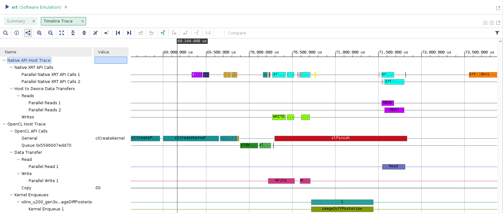

# Console Output

When running the software and hardware emulation we note significantly larger "Load Binary File to Alveo U200" times. This increase can be attributed to the need to run an internal HDL simulator capable of accurately showcasing the kernel's behavior.

## Software

\newpage

## Hardware 

# Kernels and Compute Units

The compute unit which the kernel instantiates runs around 2 times faster on the hardware emulation when compared to the software emulation. This means that the hardware-wise optimizations were able to achieve better performance even though it wasn't that impressive.

## Software

## Hardware 

\newpage

# Kernel Data Transfers

On the hardware emulation implementation we can see that the kernel transfers are comprised of 14487 reads and 592 writes. Bandwidth utilization is 78% on the writes and 70% on the reads. There is space for improvement.

## Hardware 

# Host Data Transfers

Here we see clearly what we implemented in our code. The host writes from CPU RAM (DRAM) to the FPGA's global memory the 2 matrices **A** and **B** and when the kernel concludes its execution the host can read the **C_filt** matrix to compare with the software reference in the host/testbench code.

## Software

\newpage

## Hardware

# Timeline

## Software

Entire timeline: 

{width=80%}

Zoomed in:

{width=80%}

\newpage

## Hardware 

Entire timeline:  

{width=90%}

Zoomed in at around 42 - 45 seconds:  

{width=90%}

# API Calls

## Hardware

\newpage

<!-- SUMMARY -->
# Zip Contents

- lab2.cpp  
    - Final form of lab2's kernel. Run on Vitis.
- tb_lab2.cpp
    - The host which manages the lab2's kernel. Run on Vitis.
- lab2.pdf
    - This report