<!-- SW -->
# Software Emulation

## Console Output

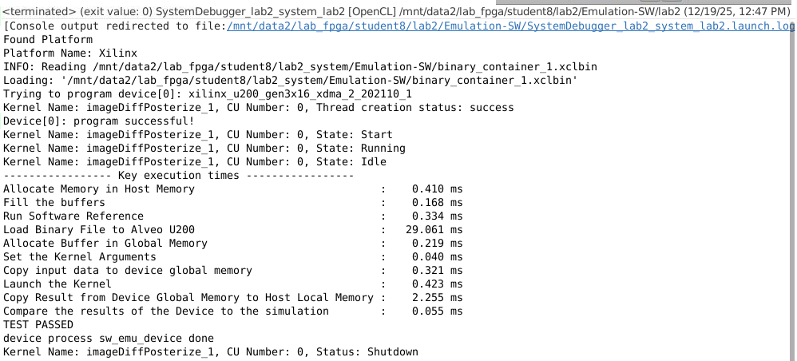

## Kernels and Compute Units

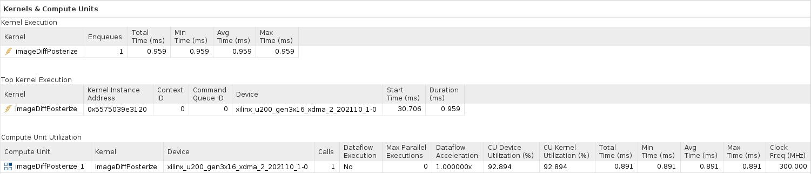

\newpage

## Host Data Transfers

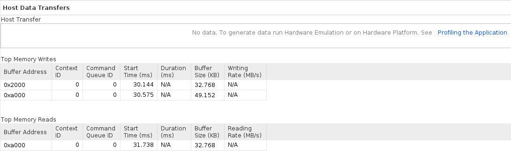

## Timeline

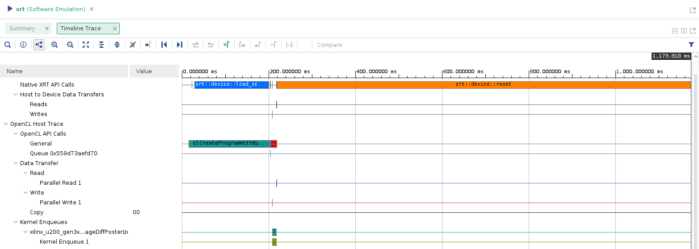

\newpage

<!-- HW -->
# Hardware Emulation

## Console Output

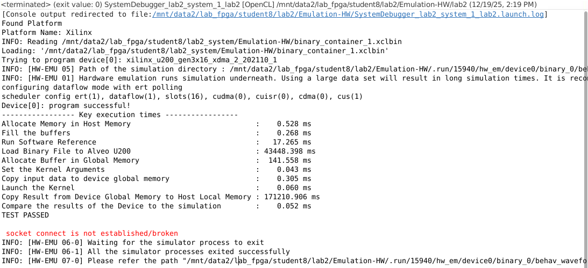

## Kernels and Compute Units

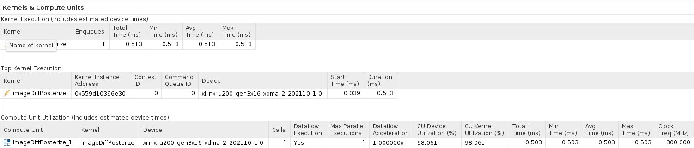

\newpage

## Host Data Transfers

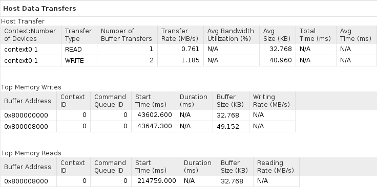

## Kernel Data Transfers

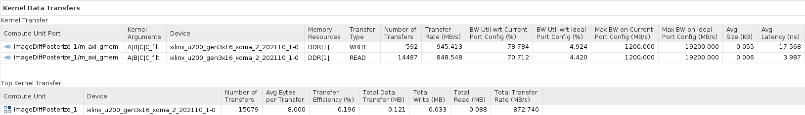

\newpage

## Timeline

Entire timeline:  

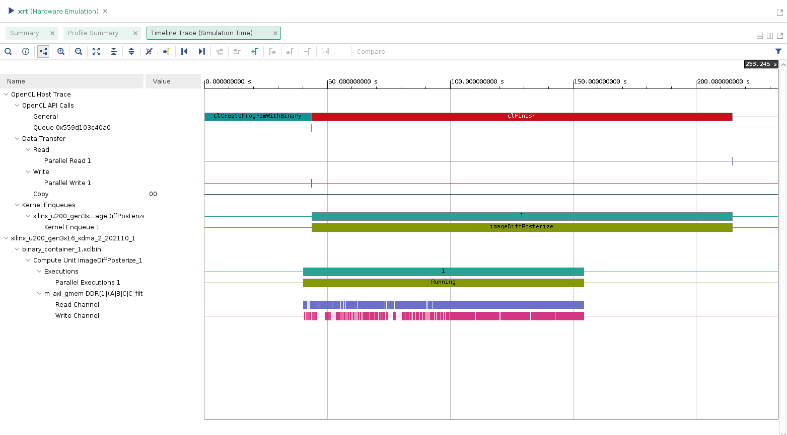{width=90%}

Zoomed in at around 42 - 45 seconds:  

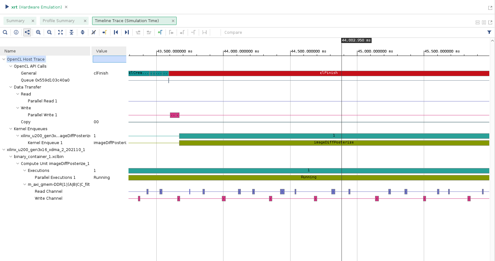{width=90%}

\newpage

## API Calls

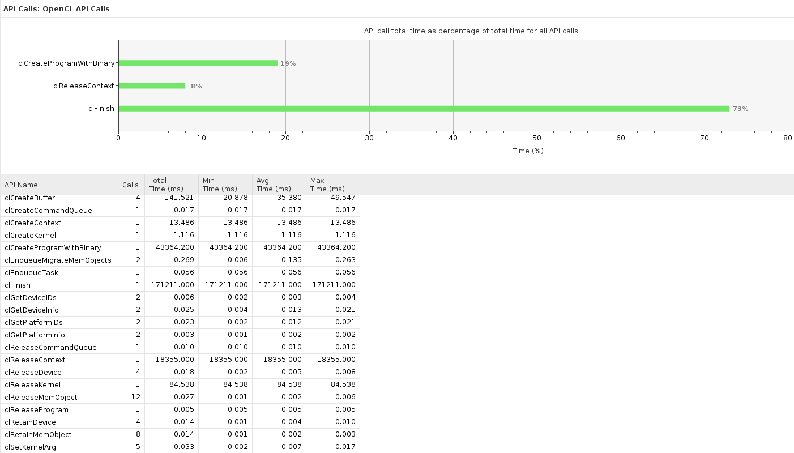

\newpage

<!-- SUMMARY -->
# Zip Contents
- lab2test.cpp
    - Locally run testing program with fully bufferized matrices.
- lab2test_easy.cpp
    -  Locally run testing program, similar to lab2.cpp but doesn't utilize buffers for the calculation of **C_filter**.
- lab2.cpp  
    - Final form of lab2's kernel. Run on Vitis.
- tb_lab2.cpp
    - The host which manages the lab2's kernel. Run on Vitis.