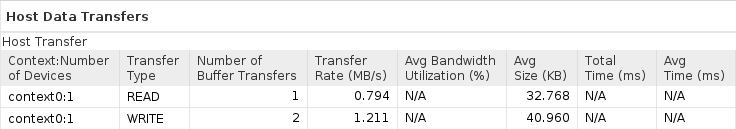
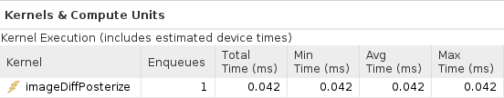

<!-- INTRODUCTION -->
# Introduction

Lab3 improves on Lab2 by:

- Vectorizing the input/output decreasing the memory accesses
- Storing the input/output to different banks achieving parallelized memory access 

# Application changes

To be able to vectorize the pixels correctly we utilize 512 bit unsigned integers which contains 16 integers each. 

$$\frac{512}{sizeof(int)}=\frac{512}{32}=16$$

Compared to lab2's code, here we cannot simply add 3 buffers containing a row and its neighboring element since we are using another layer of abstraction among the list of:
- chunks and 
- buffers.

This extra layer is the unsigned 512 bit integer which another entity that can contain our pixel. 

The solution we came upp with involves creating a single buffer which contains *BUFFER_SIZE* ***+(WIDTH/VECTOR_SIZE)\*2*** 512bit elements. This added quantity allows us to alway carry the furthermost element ,towards the front or rear end of the buffer, that we might need. These two elements are:

- the up element of the buffer's first element and
- the down element of the buffer's last element.

The real matrix's width divided by how many 32 bit integers are inside a 512 bit integer essentially tells us how many 512bit elements to the right or to the left our sought after up and down elements are.Adding two times that covers both edge cases. 

Now that we have all the info that we need in our *C_local* buffer we can continue by loading it to our intermediate variables which are used to apply sharpening and clipping. Ultimately they are stored in the *C\_filt* output pointer argument and the cycle continues until *C\_filt* is fully populated.

# New Pragmas

There are two new pragmas used on this lab:

```c
#pragma HLS DATAFLOW
#pragma HLS stream variable = A_local depth = 64
```
Dataflow enables parallelization through pipelining but on a task level which lies in contrast with *PIPELINE* which works on an instruction level. On the other side stream is applied on an array, for example variable A from the code sample, and is used when that array is consumed or produced in a sequential manner. Then a FIFO loop is used instead of RAM achieving more efficient communication. 

# Data comparison

## Kernels & Compute Units

| Kernel Execution   | lab2 64*64 | lab3 64*64 | lab3 128*128 | 
| ------------------ | ---------- | ---------- | ------------ |
| Enqueues           | 1          | 0.013      | 1            |
| Total Time (ms)    | 0.513      | 0.013      | 0.042        |
| Min Time (ms)      | 0.513      | 0.013      | 0.042        |
| Avg Time (ms)      | 0.513      | 0.013      | 0.042        |
| Max Time (ms)      | 0.513      | 0.013      | 0.042        |

## Kernel Data Transfers

| Top Kernel Data Transfer   | lab2 64*64 | lab3 64*64 | lab3 128*128 | 
| -------------------------- | ---------- | ---------- | ------------ |
| Number of Transfers        | 15079      | 297        | 1329         | 
| Avg Bytes per Transfer     | 8.000      | 115.000    | 110.000      |
| Transfer Efficiency %      | 0.196      | 2.825      | 2.691        |
| Total Data Transfer (MB)   | 0.121      | 0.034      | 0.146        |
| Total Write (MB)           | 0.033      | 0.016      | 0.066        |
| Total Read (MB)            | 0.088      | 0.018      | 0.081        |
| Total Transfer Rate (MB/s) | 872.740    | 12002.800  | 12063.900    |

## Host Data Transfer 

| Host Transfer             | lab2 64*64 | lab3 64*64 | lab3 128*128 | 
| ------------------------- | ---------- | ---------- | ------------ |
| Number of READs           | 1          | 1          | 1            |
| Number of WRITEs          | 2          | 2          | 2            |
| READ Transfer Rate (MB/s) | 0.761      | 0.794      | 3.118        |
| WRITE Transfer Rate (MB/s)| 1.185      | 1.211      | 5.253        |
| READ Average Size (kB)    | 32.768     | 32.768     | 131.072      |
| WRITE Average Size (kB)   | 40.960     | 40.960     | 163.840      |

### Comments:
Using the vectorization method we achieved an acceleration of **3946.15%**. Thanks to the implementation's performance increase we are able to use $128 \times 128$ matrices while remaining significantly faster than the non-vectorized $64 \times 64$ version ( still **1221%** acceleration). Writing and reading, of the kernel/host to and from global memory, is evidently a lot faster this time thanks to the more compact way the data is transmitted. Also, 

# Screenshots 64*64




# Screenshots 128*128




<!-- SUMMARY -->
# Zip Contents

- lab3.cpp  
    - lab3's kernel.
- tb_lab3.cpp
    - The host which manages the lab3's kernel.
- lab3.pdf
    - This report